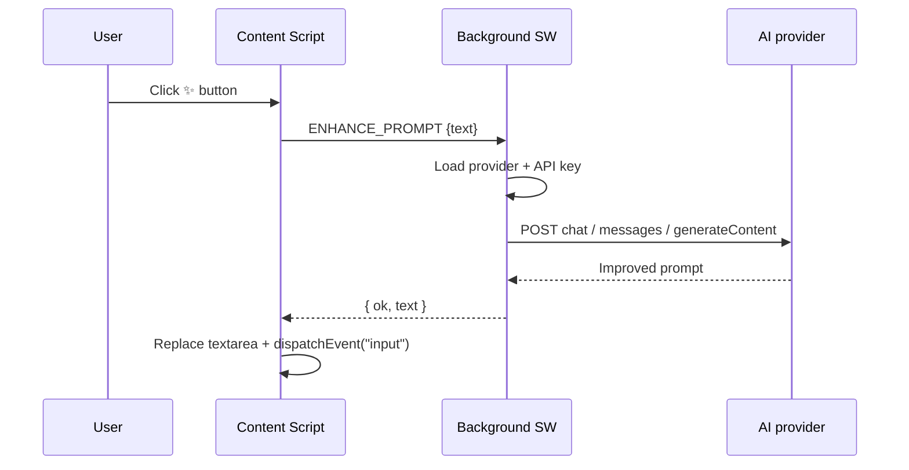

# PromptUP — AI Prompt Genius

One-click prompt enhancement for ChatGPT, Claude, and Google Gemini — a Manifest V3 Chrome extension.

- ✨ **AI Enhance button** injected next to the chat input on supported sites
- 📚 **Prompt library** with folders, tags, full-text search, template variables (`{{name}}`)
- ⚙️ **Options page** for provider / API key / model / theme / language / custom enhancement instruction
- 🌐 **Providers**: OpenAI, Anthropic (Claude), Google Gemini
- 🌍 **i18n**: Japanese & English shipped; structure ready for 22 languages
- 🎨 Dark / light themes, 380 px side panel, WCAG 2.1 AA contrast

## Requirements

- Node.js 20 LTS or later
- Google Chrome 110+ (Side Panel API support)

## Quick start

```bash
npm install
npm run build           # produces ./dist (the extension root)
```

Then in Chrome:

1. Open `chrome://extensions`
2. Toggle **Developer mode** (top-right)
3. Click **Load unpacked** and select the `dist/` directory
4. Pin PromptUP from the toolbar and open the settings (right-click the icon → Options) to enter an API key

## Development

```bash
npm run dev
```

Vite serves the extension with HMR. With `@crxjs/vite-plugin`, the `dist/` folder still needs to be loaded via **Load unpacked** in Chrome; the plugin updates it as you edit files.

Useful scripts:

| Command | Description |
| --- | --- |
| `npm run dev` | Vite dev server + HMR |
| `npm run build` | Type-check, generate icons, production build into `dist/` |
| `npm run build:plugin` | Alias of `build` (per spec) |
| `npm run gen:icons` | Regenerate PNG icons from `public/icons/icon.svg` |
| `npm run test` | Vitest unit tests |

## Configuring API keys

Open the extension’s **Options** page and paste an API key for the provider you want to use.

| Provider | Where to get a key | Default model |
| --- | --- | --- |
| OpenAI | <https://platform.openai.com/api-keys> | `gpt-4o-mini` |
| Anthropic (Claude) | <https://console.anthropic.com/settings/keys> | `claude-haiku-4-5` |
| Google Gemini | <https://aistudio.google.com/app/apikey> | `gemini-2.0-flash` |

Keys are persisted in `chrome.storage.local` with lightweight XOR obfuscation. MV3 cannot offer true at-rest encryption — treat this as defense-in-depth, not a cryptographic guarantee. Keys are never sent anywhere except the provider endpoint you selected.

## How the AI enhance flow works



The request runs with a 30 s timeout. Errors are classified (`NO_API_KEY`, `AUTH`, `RATE_LIMIT`, `TIMEOUT`, `NETWORK`, `PROVIDER_ERROR`, …) and surfaced as a toast.

## Project layout

```
.
├── public/
│   ├── _locales/                 # Chrome-native i18n (extension name + description)
│   └── icons/                    # icon.svg + generated PNGs (16/32/48/128)
├── scripts/
│   └── gen-icons.mjs             # SVG → PNG, run via `prebuild`
├── src/
│   ├── background/               # Service worker + provider adapters
│   │   ├── index.ts
│   │   └── providers/{openai,anthropic,gemini}.ts
│   ├── components/               # Shared UI (Modal, Toast, Icons)
│   ├── content/                  # ✨ button injection, ChatGPT/Claude/Gemini adapters
│   ├── context/                  # SettingsContext, LibraryContext
│   ├── i18n/                     # i18next + locales/{ja,en}.json
│   ├── lib/                      # types, storage, crypto, messaging, prompt-vars
│   ├── manifest.ts               # MV3 manifest
│   ├── styles/globals.css        # Tailwind layers + CSS variables (dark/light)
│   └── ui/
│       ├── popup/                # Toolbar popup
│       ├── sidepanel/            # Main library UI (380 px)
│       └── options/              # Settings page
├── tailwind.config.js
├── vite.config.ts
└── tsconfig.json
```

## Supported sites

| Site | URL | Selector |
| --- | --- | --- |
| ChatGPT | `https://chatgpt.com/*`, `https://chat.openai.com/*` | `#prompt-textarea`, `textarea[data-id="prompt-textarea"]` |
| Claude | `https://claude.ai/*` | `div[contenteditable="true"].ProseMirror` |
| Gemini | `https://gemini.google.com/*` | `rich-textarea .ql-editor` |

Because these DOM structures change often, selectors are re-resolved via `MutationObserver`.

## Keyboard shortcuts

| Shortcut | Action |
| --- | --- |
| `Cmd/Ctrl + Shift + U` | Toggle side panel |
| `Cmd/Ctrl + Shift + P` | Open quick search (when content script is loaded) |

## Adding more languages

1. Copy `src/i18n/locales/en.json` to `src/i18n/locales/<lang>.json`
2. Translate values, then add to `src/i18n/index.ts` (`resources` + `SUPPORTED_LANGUAGES`)
3. Optionally add a corresponding `public/_locales/<lang>/messages.json` for the extension name/description

The spec calls for 22 languages; this release ships `ja` and `en` with a structure ready for the remaining 20.

## Roadmap (future phases)

- JSON / CSV export & import (F-16 / F-17)
- Automatic prompt history capture on AI chat sites (F-18)
- Prompt version history
- Firefox / Edge builds

## License

MIT
